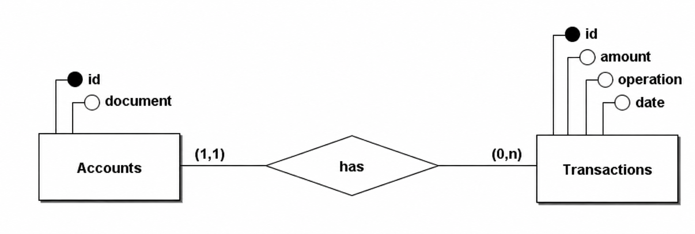

# Visa Breno

A Spring Boot service for managing cardholder accounts and transactions. The
application runs on Java 21 and uses PostgreSQL for persistence.

## Run the application

Docker with the Compose plugin is the only runtime requirement. Java, Maven,
the application, and PostgreSQL run inside containers.

Start the application and database:

```bash
./run
```

`./run up -d` Detached mode is also supported.

The API is available at
`http://localhost:8080` after startup completes.

Stop and remove the application and database containers:

```bash
./run down
```

The PostgreSQL data remains stored in its Docker volume. To also delete that
data:

```bash
./run down -v
```

## Run script commands

| Command             | Description                                                 |
|---------------------|-------------------------------------------------------------|
| `./run`             | Build and start the application and PostgreSQL.             |
| `./run up`          | Same as `./run`.                                            |
| `./run up -d`       | Build and start everything in the background.               |
| `./run database`    | Start only PostgreSQL and show its logs.                    |
| `./run database -d` | Start only PostgreSQL in the background.                    |
| `./run down`        | Stop and remove the Compose containers and network.         |
| `./run down -v`     | Stop everything and also delete the PostgreSQL data volume. |
| `./run test`        | Run the test suite with minimal test output.                |
| `./run test -v`     | Run the test suite with verbose test output.                |

Additional arguments are forwarded to Docker Compose or Maven.

## Tests

Run the complete test suite:

```bash
./run test
```

Use `-v` to display verbose test output, or select one category through its
JUnit tag:

```bash
./run test -v
./run test -Dgroups=domain
```

Unlike application startup, `./run test` invokes the Maven wrapper on the host
and therefore requires JDK 21. The `e2e` and `database-adapter` categories also
require Docker because they create PostgreSQL containers with Testcontainers.

The suite is divided into six categories:

| Tag | Purpose |
|-----|---------|
| `e2e` | Exercises complete user flows through a real HTTP server, application services, JDBC adapters, and a Testcontainers PostgreSQL database. It verifies that all layers work together from request to persisted data and response. |
| `smoke` | Starts the Spring application context to confirm that configuration, dependency injection, and bean wiring are valid. It is a small startup check rather than a behavioral test. |
| `domain` | Tests business rules in isolation, including document validation, operation types, transaction signs, amount validation, and timestamps. Repository ports are mocked, so Spring, HTTP, and PostgreSQL are not involved. |
| `http-adapter` | Tests controllers with standalone MockMvc and mocked domain services. These tests verify JSON mapping, request validation, HTTP status codes, response bodies, and domain-error conversion without starting a real server. |
| `database-adapter` | Tests JDBC repository implementations against a real Testcontainers PostgreSQL instance. These tests cover SQL mappings, generated IDs, database constraints, and translation of SQL failures into domain errors. |
| `architecture` | Uses ArchUnit to enforce package and dependency boundaries, including keeping the domain independent from Spring and preventing adapters from violating the hexagonal dependency direction. |

Run any category by passing its tag:

```bash
./run test -Dgroups=e2e
./run test -Dgroups=smoke
./run test -Dgroups=domain
./run test -Dgroups=http-adapter
./run test -Dgroups=database-adapter
./run test -Dgroups=architecture
```

## API

The examples assume the service is running at `http://localhost:8080`.

### Healthcheck

```bash
curl http://localhost:8080/healthcheck
```

Successful response — `200 OK`:

```json
{
  "status": "UP"
}
```

### Create an account

The document number must contain exactly 11 characters.

```bash
curl -i -X POST http://localhost:8080/accounts \
  -H 'Content-Type: application/json' \
  -d '{"document_number":"12345678900"}'
```

Successful response — `201 Created`:

```json
{
  "account_id": 1,
  "document_number": "12345678900"
}
```

Possible errors:

| Status            | Cause                                                                                                         |
|-------------------|---------------------------------------------------------------------------------------------------------------|
| `400 Bad Request` | Malformed JSON, a missing/null/empty document number, or a document number whose length is not 11 characters. |
| `409 Conflict`    | An account with the same document number already exists.                                                      |

### Get an account

```bash
curl -i http://localhost:8080/accounts/1
```

Successful response — `200 OK`:

```json
{
  "account_id": 1,
  "document_number": "12345678900"
}
```

Possible errors:

| Status            | Cause                                    |
|-------------------|------------------------------------------|
| `400 Bad Request` | The account ID is not a number.          |
| `404 Not Found`   | No account exists with the requested ID. |

### Create a transaction

The request amount must be positive and have exactly two decimal places. The
application applies the operation's sign before storing and returning it.

```bash
curl -i -X POST http://localhost:8080/transactions \
  -H 'Content-Type: application/json' \
  -d '{"account_id":1,"operation_type_id":1,"amount":100.00}'
```

Successful response — `201 Created`:

```json
{
  "transaction_id": 1,
  "account_id": 1,
  "operation_type_id": 1,
  "amount": -100.00,
  "occurred_at": "2026-10-07T12:30:00Z"
}
```

The timestamp is generated by the server in UTC. Supported operation types are:

| ID  | Operation                  | Stored sign |
|-----|----------------------------|-------------|
| `1` | Normal purchase            | Negative    |
| `2` | Purchase with installments | Negative    |
| `3` | Withdrawal                 | Negative    |
| `4` | Credit voucher             | Positive    |

Possible errors:

| Status            | Cause                                                                      |
|-------------------|----------------------------------------------------------------------------|
| `400 Bad Request` | Malformed JSON or a missing/null request field.                            |
| `400 Bad Request` | The operation type is not one of `1`, `2`, `3`, or `4`.                    |
| `400 Bad Request` | The amount is zero, negative, or does not have exactly two decimal places. |
| `404 Not Found`   | The referenced account does not exist.                                     |

## Database

The service uses PostgreSQL 17. Compose exposes it on `localhost:5432` and
stores its data in the `postgres_data` named volume. The schema is defined in
`init.sql` and is applied when PostgreSQL initializes an empty volume.

To apply a changed initialization script from scratch:

```bash
./run down -v
./run
```

### Database model



The schema contains:

- `accounts`: generated ID and unique 11-character document number.
- `transactions`: generated ID, operation code, signed amount, timestamp, and
  account foreign key.
- An index on `transactions.account_id` for account-based transaction lookups.
- Database constraints for document length, supported operation codes,
  uniqueness, and referential integrity.

### Monetary values

Transaction amounts use Java `BigDecimal` and PostgreSQL `NUMERIC(19, 2)`
instead of binary floating-point types such as `double`. Decimal arithmetic
keeps monetary values exact and avoids binary rounding errors between the API,
domain, and database. The domain requires incoming amounts to have exactly two
decimal places before they are persisted.

## Architecture

The application follows hexagonal architecture. Business rules live in the
domain and communicate with infrastructure through ports, keeping Spring MVC,
JDBC, and PostgreSQL outside the core model.

```text
HTTP request
    |
    v
Inbound adapter (adapter/http)
    |
    v
Application/domain services (domain)
    |
    v
Repository ports (domain)
    |
    v
Outbound adapter (adapter/postgres)
    |
    v
PostgreSQL
```

The main components are:

- **Domain:** entities, operation types, business services, repository ports,
  and domain errors. It depends only on the Java standard library.
- **Inbound adapter:** Spring MVC controllers and HTTP request/response DTOs.
- **Outbound adapter:** JDBC implementations of the repository ports and
  translation of database constraint failures into domain errors.
- **Configuration:** the composition root that connects adapters, services,
  repository ports, and the UTC clock.
